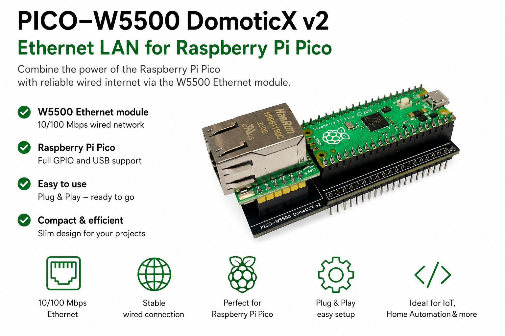
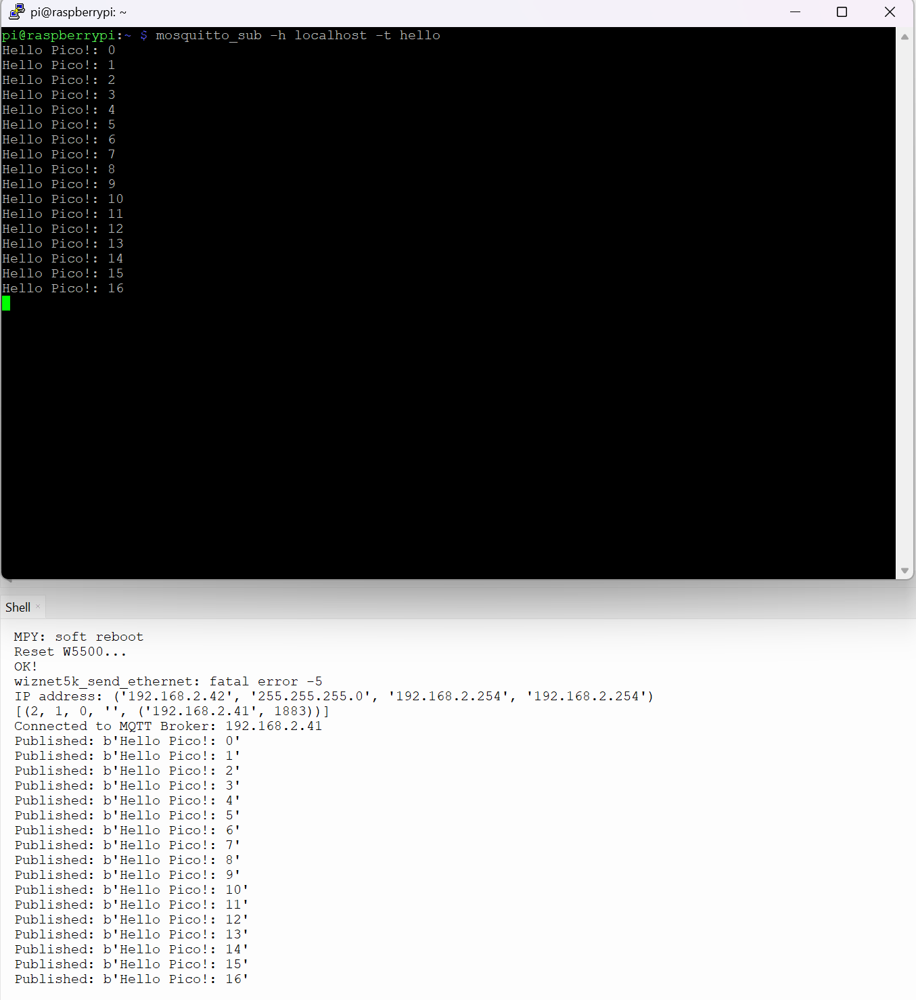
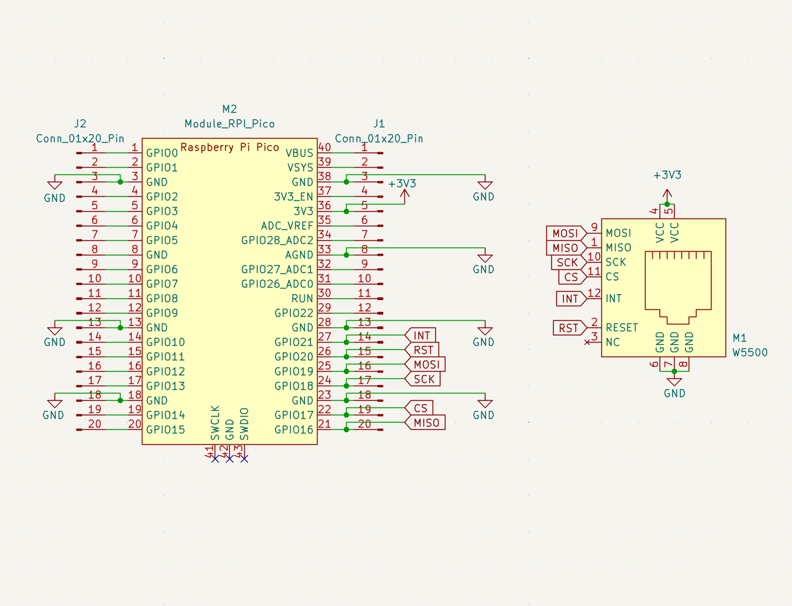

Ethernet LAN expansion board for the Raspberry Pi Pico using the powerful W5500 Ethernet controller.

---

## Overview

The **PICO-W5500 DomoticX v2** is a compact custom PCB designed to combine a **Raspberry Pi Pico** with a **W5500 Ethernet module**, providing reliable wired Ethernet connectivity for your projects.

Unlike WiFi, Ethernet offers a stable low-latency network connection, making this board ideal for:

- IoT projects
- Home automation
- Industrial applications
- MQTT communication
- Embedded webservers
- Data logging
- Sensor gateways
- Network-enabled microcontroller projects

The board is easy to assemble and allows you to quickly add professional Ethernet functionality to your Raspberry Pi Pico projects.

---

## Features

- Compatible with Raspberry Pi Pico
- W5500 Ethernet controller
- 10/100 Mbps Ethernet LAN
- Stable wired network connection
- Compact custom PCB design
- Easy to use
- SPI communication interface
- Ideal for IoT and automation projects

---

## Specifications

| Feature | Description |
|---|---|
| Ethernet Controller | W5500 |
| Network Speed | 10/100 Mbps |
| Interface | SPI |
| Compatibility | Raspberry Pi Pico / Pico H |
| Power Supply | Via Pico USB |
| PCB Type | Custom compact adapter board |

---

## Applications

- Home Automation
- MQTT Clients & Brokers
- Industrial Monitoring
- Ethernet Webservers
- Sensor Interfaces
- Data Logging Systems
- Smart Devices
- Embedded Networking

---

## Assembly

1. Insert the Raspberry Pi Pico into the PCB headers
2. Connect the W5500 Ethernet module
3. Solder all required pins
4. Connect Ethernet cable
5. Upload your firmware

---

## Software Support

The board works with many popular development environments:

- MicroPython
- Arduino IDE
- PlatformIO
- C/C++ SDK
- CircuitPython

The W5500 chip is widely supported and easy to integrate into existing projects.

---

## Example Use Cases

- MQTT sensor node
- Ethernet-controlled relay board
- Industrial data logger
- Local web dashboard
- Smart home controller
- TCP/IP communication projects

---

## Why Ethernet?

Compared to WiFi, wired Ethernet offers:

- Higher stability
- Lower latency
- Better reliability
- Reduced interference
- Improved industrial compatibility

Perfect for mission-critical or always-online applications.

---

## Package Contents

- 1x PICO-W5500 DomoticX v2 PCB
- Raspberry Pi Pico *(optional)*
- W5500 Ethernet module *(optional)*

---

## License

Designed by DomoticX.

---

## Links

- Where to buy: [DomoticX](https://domoticx.net/?s=pico+w5500&post_type=product)
- Compatible Pico firmware: [W5500_EVB_PICO](https://micropython.org/download/W5500_EVB_PICO/)

---

## MQTT Example

See folder: "python-example".

---

## Schematic

---
